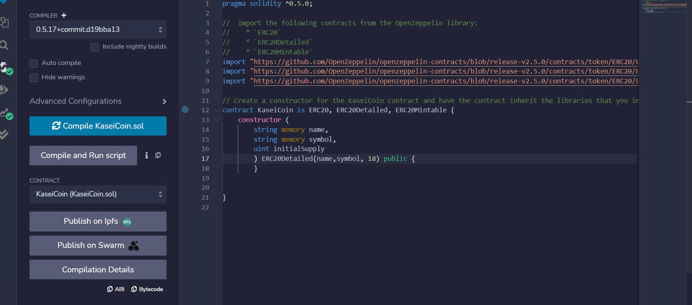
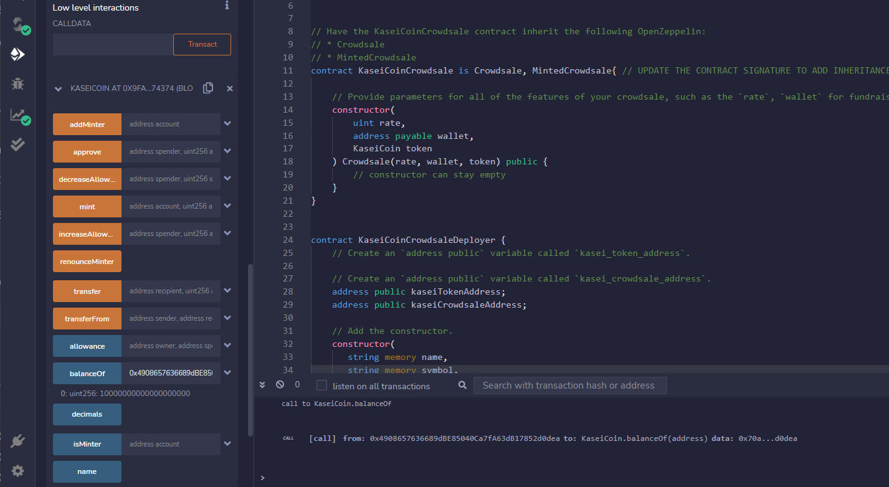

# Unit 21: Martian Token Crowdsale
In this assignment, I created the KaseiCoin Token contract, the KaseiCoin crowdsale contract, and the Kaseicion Deployer contract. I deployed and tested the Crowdsale on a Local Blockchain. 

###Evaluation Evidence

Screenshot of the compilation of the KaseiCoin Token contract

Screenshot of the compilation of the KaseiCoin crowdsale contract

Screenshot of the compilation of the KaseiCoin crowdsale deployer contract

Screenshot of Deploy the crowdsale to a local blockchain by using Remix, MetaMask, and Ganache.

Screenshot of buying new tokens 

Screenshot of checking the balances

Screenshot of total supply of minted tokens and the amount of wei that the crowdsale contract has raised

 Sreenshot of sending ether to the crowdsale from a different account

 

 Screenshot of finalizing the sale

 

Screenshot of tokens in MetaMask

